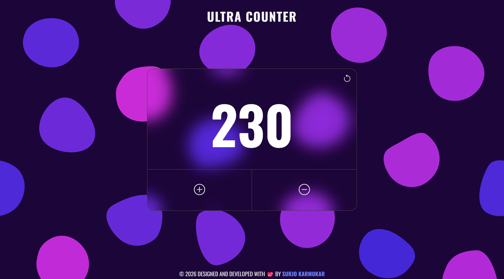
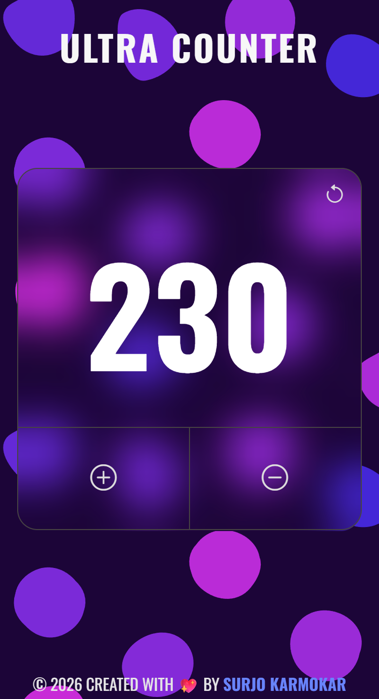

<h1 align="center">🌐 Ultra Counter</h1>

  <b>A powerful, responsive, and minimalist counter app built with HTML, CSS, and JavaScript. Featuring modern Glassmorphism UI and Local Storage.</b>

## ✨ Features
- 🧊 **Glassmorphism UI** - Sleek frosted-glass effect with a vibrant dark theme  
- 💾 **Local Storage Support** - Saves your count automatically so data persists after refresh  
- 📱 **Fully Responsive** - Optimized for seamless use across mobile, tablet, and desktop  

## 🧩 Technologies Used
- HTML5
- CSS3 
- JavaScript (ES6+) 

## 📸 Screenshots

<strong> Desktop view (1440px)</strong>

 

<strong> Mobile view (375px)</strong>

 

## 🚀 How To Run

**You can run this project in two ways:**

### 1. Run Locally

📥 Clone the repository and open the `index.html` file in your browser.

`or`

### 2. View Online

🔗 Visit **[ultracounter.pages.dev](https://ultracounter.pages.dev/)**

## 👨‍💻 Created by [Surjo Karmokar](https://surjo.pages.dev/)

  ⭐ If you found this project helpful, consider giving the repo a star :)

